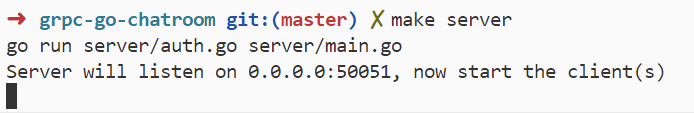
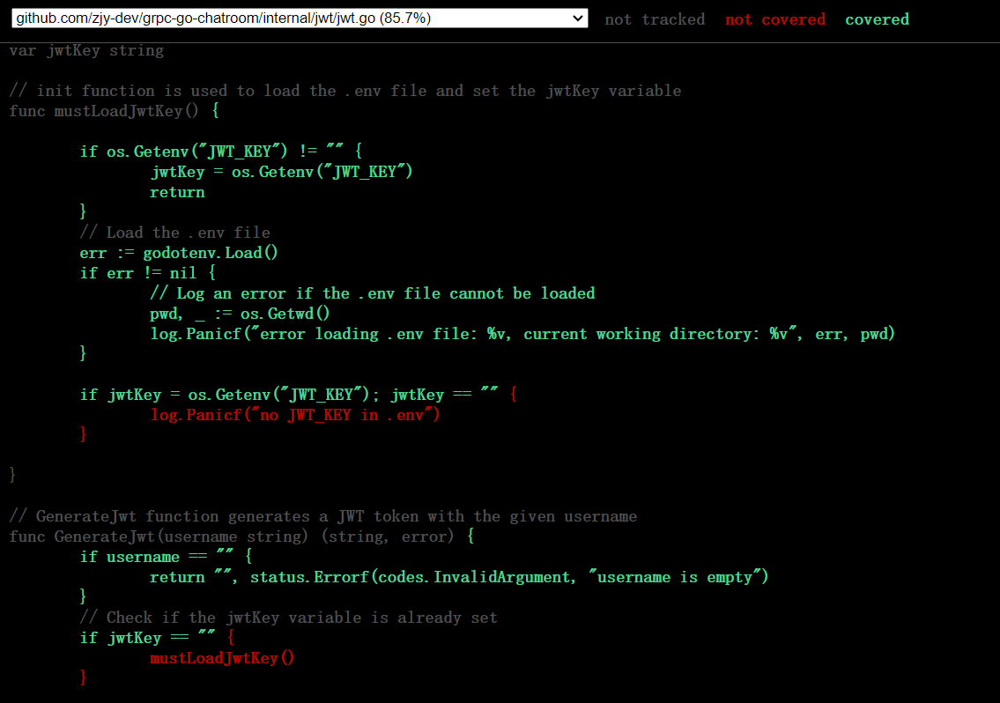

<div align="center" id="top"> 
  

  &#xa0;

  <!-- <a href="https://grpcgochatroom.netlify.app">Demo</a> -->
</div>

<h1 align="center">Grpc Go Chatroom</h1>

<p align="center">
  

  

  

  

  <!--  -->

  <!--  -->

  <!--  -->
</p>

<!-- Status -->

<!-- <h4 align="center"> 
	🚧  Grpc Go Chatroom 🚀 Under construction...  🚧
</h4> 

<hr> -->

<p align="center">
  <a href="#dart-about">About</a> &#xa0; | &#xa0; 
  <a href="#sparkles-features">Features</a> &#xa0; | &#xa0;
  <a href="#rocket-technologies">Technologies</a> &#xa0; | &#xa0;
  <a href="#white_check_mark-requirements">Requirements</a> &#xa0; | &#xa0;
  <a href="#checkered_flag-starting">Starting</a> &#xa0; | &#xa0;
  <a href="#memo-license">License</a> &#xa0; | &#xa0;
  <a href="https://github.com/zjy-dev" target="_blank">Author</a>
</p>

<br>

## :dart: About ##

A **learning-purpose** chatroom built with [gRPC-go](https://github.com/grpc/grpc-go), integrates **modern** development toolchain.

Every **development process**(e.g.commit messages) conforms to corresponding specifications, and particularly the code conforms to the [Google Go StyleGuide](https://google.github.io/styleguide/go/).

Even the **README itself** is part of my learning for software-engineering specifications, cool, right?

I'll write everything I learned **(and also the source I've learned them!!!)** below, if you are new to both gRPC-go and software-engineering, definitely check out.


## :sparkles: Features ##
:heavy_check_mark: **Deploy**: Use go's *embed* compile, only a binary file needed(also you can use docker)
:heavy_check_mark: **Testing**: Use *Testify* for *assertions and mocks*.\
:heavy_check_mark: **Building**: Use *Makefile*, which is the best building tool for go projects.
:heavy_check_mark: **Auth**: Use *jwt* to manage user log in/out.\
:heavy_check_mark: **Continuous Integration**: Use *Github Actions* to automatically build and test.\
:heavy_check_mark: **Command Line**: Use *urfave/cli* for client's command-line version.\


## :rocket: Technologies ##

The following tools were used in this project:

- [gRPC-go](https://expo.io/)
- [gRPC-go-middleware](https://github.com/grpc-ecosystem/go-grpc-middleware)
- [testify](https://github.com/stretchr/testify)
- [jwt](https://github.com/golang-jwt/jwt)
- [urfave/cli](https://github.com/urfave/cli)
- [Makefile](https://makefiletutorial.com/)
- [github actions](https://www.bilibili.com/video/BV1aT421y7Ar)
- to add more...
## :white_check_mark: Requirements ##

Clone the repo to your local environment and download require packages. 
```bash
$ git clone https://github.com/zjy-dev/grpc-go-chatroom.git

$ cd grpc-go-chatroom && go mod tidy
```
## :checkered_flag: Starting ##

First, run the server in one terminal:
```bash
$ make server
```


Then, run the client in another terminal, remember specify YOURNAME:
```bash
$ make client name="YOURNAME"
```

After the client successfully connected to the server, you can inputting messages in the terminal and press enter to shoot it.


You can also run multiple clients to chat with each other!

## ✅ Testing ##

You can test everything in one command below:
```bash
$ make test 
``` 

## 📊 Coverage ##

You can see coverage in CLI using below command:
```bash
$ make coverage
```

Or if you want a html version that displays whether every-single-word in the code has been covered, use following command:
```bash
$ make coverage-html
```
Then coverage.html will appear in your root directory, and looks just like below img, check it out! 



## :memo: License ##

This project is under license from MIT. For more details, see the [LICENSE](LICENSE.md) file.


Made with :heart: by <a href="https://github.com/zjy-dev" target="_blank">zjy-dev</a>

&#xa0;

<a href="#top">Back to top</a>
